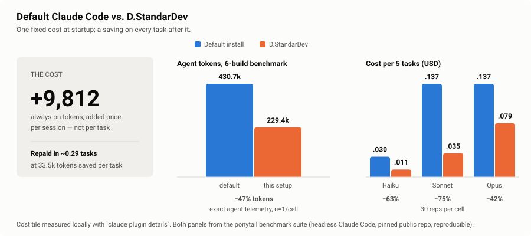

<div align="center">


# D.StandarDev

**An opinionated, portable Claude Code setup — one script, one standard, every machine.**

[](https://claude.com/claude-code)
[](#skills)
[](#plugins)
[](#benchmark-default-vs-dstandardev)
[](LICENSE)

</div>

---

## What this is

`D.StandarDev` is the whole Claude Code configuration I actually work with — global engineering
rules, domain skills, and the plugin set — packaged so a fresh machine goes from *default Claude*
to *my Claude* with a single command.

It is not a prompt collection. It is a **standard**: the same guardrails, the same review discipline,
and the same tooling on every project you open.

> **This is a personal setup, not a generic one.** Every skill and plugin here is one I actually
> use day to day, tuned to the stack I build on. It is shared as-is — if your stack differs, treat
> this as a starting point and swap the parts that do not fit.

```bash
git clone https://github.com/Rhay427/D.StandarDev.git
cd D.StandarDev
./install.sh
```

---

## The idea

Most Claude configs are a pile of rules that make Claude do *more*: more checks, more planning,
more files. That is why they feel slow and why people turn them off.

This one is built on the opposite bet — **the win is in what Claude decides not to do.**

Three rules carry almost all of it:

**1. Small tasks stay small.** Every skill opens with a gate before anything else happens:

> **Fast path (most tasks)** — a copy tweak, a style change, wiring an existing prop, a small bug
> fix. Read only the file(s) you're touching and make the change directly. If you want to confirm
> a convention is really the established one, one grep or one comparable file is enough evidence —
> don't collect a second or third confirming example, and don't audit the directory structure.
>
> — `claude/skills/frontend/SKILL.md`

Without that gate, "change this label" costs you a repo tour. This is the rule you will feel on
day one.

**2. Reach for what already exists — in the codebase, then in the platform.** Search before
creating a component, a hook, a util, a type. Then check whether the browser already does it:
`<input type="date">` is 23 lines where a hand-built picker is 404. That single reflex is the
largest measured effect in the benchmark below.

**3. Verification is scoped, and never claimed.** Run the smallest check that would actually catch
the mistake — not a full build for a one-line change. And Claude may not say a test passed unless
it ran.

Everything else — the security baseline, the git safety rules, the platform-scope questions — is
guardrail. These three are the reason the token count goes down.

---

## What it changes on a small task

The rule you'll feel first isn't about how much code Claude writes — that's `ponytail`'s job, and
its numbers are in the benchmark below. This is about how much Claude *reads* before it writes.

The ticket: *"the empty-state text on the items list says 'No data' — make it 'No items yet.'"*

**Default behavior.** A one-line change, but nothing says so up front. Grep the string. Open the
component. Open its parent to see how it's rendered. Check whether a shared `EmptyState` component
already exists that should be used instead. Read two sibling features to confirm the convention.
Then change one string, and run the project's full lint to be safe.

**With this setup.** The `frontend` skill's first section classifies the task before anything
happens — a copy tweak is the fast path, so: open the file, change the string, type-check the file
you touched. Done.

The gate is the whole mechanism, quoted from `claude/skills/frontend/SKILL.md`:

> Read only the file(s) you're touching and make the change directly. If you want to confirm a
> convention (a color, a spacing pattern, a naming style) is really the established one, one grep
> or one comparable file is enough evidence — don't collect a second or third confirming example,
> and don't audit the directory structure.

Every skill here opens with that same classification, tuned to its domain: `backend` splits on
trivial vs. cross-layer, `testing` on whether coverage already exists, `mobile` on whether the
change is platform-specific at all.

*This is what the rules instruct, illustrated — not a measured result. The measured numbers are
below, and they belong to `ponytail`.*

---

## Benchmark: default vs. D.StandarDev

> **Whose numbers these are.** The always-on cost is measured on this setup. Everything that goes
> *down* is measured by the [ponytail](https://github.com/DietrichGebert/ponytail) project's own
> benchmark suite and belongs to them — this repo installs ponytail, it did not produce these
> results. Sources and method are in [How these numbers were produced](#how-these-numbers-were-produced).



**The short version: this setup costs ~9.8k tokens once per session and pays that back
before the first task finishes.**

| Measure | Default install | D.StandarDev | Change |
|---|--:|--:|--:|
| Always-on session context | ~0 tok | **9,812 tok** | +9,812 (paid once) |
| Agent tokens, 6-build benchmark | 430,697 | **229,370** | **&minus;47%** |
| Cost per 5 tasks — Haiku | $0.0299 | **$0.0110** | **&minus;63.1%** |
| Cost per 5 tasks — Sonnet | $0.1367 | **$0.0348** | **&minus;74.5%** |
| Cost per 5 tasks — Opus | $0.1368 | **$0.0789** | **&minus;42.3%** |
| Correctness | 76-100% | **100%** | no regression |
| Wall time | 2,749s | **821s** | 3.3x faster |

### Break-even

The 6-build benchmark saved 201,327 tokens across 6 tasks — about **33,554 tokens per task**.
The session overhead is 9,812 tokens. So the setup pays for itself in

```
9,812 / 33,554 ≈ 0.29 tasks
```

**less than a third of one task.** Every task after that is net savings, and the overhead is
charged once per session while the savings recur per task. On a ten-task day the setup costs
~9.8k tokens and returns ~335k.

### Why it goes down

The overhead is *static context*: skill names and one-line descriptions, plus the global
`CLAUDE.md`. Full skill bodies load only when a task matches — progressive disclosure, not an
always-on tax.

What shrinks is the *work*. Fewer lines written is fewer tokens spent — on the write, and on
every later read of that file. Three things drive it: the platform-before-component rule (the
date picker above), the fast-path gate that stops a one-line change from becoming a repo tour,
and the scope control that prevents unrequested refactors and the re-reads, re-edits, and
re-reviews they generate.

### How these numbers were produced

| Figure | Source | Method |
|---|---|---|
| Always-on context (the cost tile) | Measured on this machine | `claude plugin details <plugin>` summed over all 20 plugins (7,985 tok), plus the skill index (~359 tok) and `CLAUDE.md` (~1,468 tok) |
| Agent tokens | [ponytail benchmark suite](https://github.com/DietrichGebert/ponytail) | 6 real builds + 2 extensions in headless Claude Code, exact agent telemetry, arms isolated via `--plugin-dir` |
| Cost per 5 tasks | ponytail benchmark suite | promptfoo, 3 pooled runs = **30 reps per cell**, median cost per task summed over 5 tasks |

Reproduce the ponytail arms yourself:

```bash
npx promptfoo@latest eval -c benchmarks/promptfooconfig.yaml --repeat 10
```

### Honest caveats

Read these before quoting the numbers.

- **Both benchmark panels measure `ponytail` alone, not the whole setup.** It is the single largest
  contributor to the reduction, but the other 19 plugins and the 5 skills are not covered by
  any published benchmark. Treat the &minus;47% as *this setup's biggest lever measured in isolation*,
  not a whole-setup figure.
- **The 6-build token benchmark is n=1 per cell.** The cost benchmark is the rigorous one
  (30 reps). The direction is consistent across both; the exact percentage is not precise.
- **The win is Claude-specific.** ponytail's maintainers measured the same ruleset costing *more*
  on OpenAI's reasoning models (gpt-5.5: +38.7%) — the rules ride along as input on every
  request, and those models were not verbose to begin with, so there is little to trim. This
  standard targets Claude Code and makes no cross-provider claim.
- **Overhead is mostly cached.** The 9,812 tokens sit in the cached prefix of a session, so
  the billed cost is well below the raw count — which makes the break-even above conservative.
- **No benchmark measures rework.** The scope-control and verification rules in `CLAUDE.md`
  are there to prevent wasted turns. That should reduce tokens further; it is unmeasured, so
  it is claimed nowhere above.

---

## The stack this is tuned for

These skills were written for the way I build, and the plugin set mirrors it. Nothing here is
theoretical — each entry earns its place on real projects.

| Layer | What I use | Covered by |
|---|---|---|
| Language | TypeScript | `frontend`, `backend`, `zod`, `tsdown` |
| Web | React, Next.js, Vite, Astro | `frontend`, `frontend-design`, `vite`, `astro` |
| Mobile | React Native, Expo, Flutter | `mobile` |
| Backend & data | Supabase, Postgres, REST services | `backend`, `supabase` |
| Validation | Zod | `backend`, `zod` |
| Testing | Vitest, Playwright | `testing`, `vitest`, `playwright-cli` |
| Packaging | pnpm workspaces, tsdown | `pnpm`, `tsdown` |
| Design | Figma | `figma`, `frontend-design` |
| Workflow | Git, GitHub PRs | `git`, `github` |
| Terminal | Ghostty | — (nothing here assumes a terminal) |

If you work on a different stack, keep `CLAUDE.md`, `git`, and `testing` — they are stack-neutral —
and replace the rest.

No terminal integration ships here — I run [Ghostty](https://ghostty.org), and nothing in this
setup depends on which terminal you use.

---

## Contents

```
D.StandarDev/
├── assets/
│   └── standardev.png
├── claude/
│   ├── CLAUDE.md            # global engineering standard
│   ├── settings.json        # model, effort, marketplaces, enabled plugins
│   └── skills/
│       ├── frontend/        # React, Next.js, Vite, TS, a11y (+ references/)
│       ├── backend/         # REST, DB, authN/authZ, validation, jobs
│       ├── mobile/          # React Native, Expo, Flutter, iOS, Android
│       ├── testing/         # unit, component, integration, E2E, build checks
│       └── git/             # safe branch, diff, rebase, PR, release flow
└── install.sh
```

---

## Requirements

- [Claude Code CLI](https://claude.com/claude-code) on your `PATH`
- `git`
- macOS or Linux (`bash`)

---

## Install

```bash
./install.sh
```

The script backs up any existing `~/.claude/CLAUDE.md` and matching skills into
`~/.claude/backups/standardev-<timestamp>/`, installs the rules and skills, adds `settings.json`
only if you don't already have one, then registers the marketplaces and installs the plugins.

Then restart Claude Code.

### Profiles — don't take the parts you won't use

Every plugin costs a little always-on context whether or not you trigger it, so install the tier
that matches your work:

```bash
PROFILE=core ./install.sh    # the discipline only
PROFILE=web  ./install.sh    # + React/Vite/Astro/Figma/testing tooling
PROFILE=data ./install.sh    # + Supabase and web research
./install.sh                 # everything (default)
```

| Profile | Plugins | Always-on cost | Share of a 1M window | Take it if |
|---|--:|--:|--:|---|
| `core` | 9 | 3,909 tok | 0.39% | You want the rules, review discipline, and `ponytail`. Stack-agnostic. |
| `web` | 18 | 7,143 tok | 0.71% | You build web frontends in TypeScript. |
| `data` | 11 | 6,578 tok | 0.66% | You work on Supabase/Postgres backends. |
| `all` | 20 | 9,812 tok | 0.98% | You do all of it — this is what I run. |

The skills and `CLAUDE.md` install in every profile; they're 1,827 of the tokens above and they
are the part that does the work.

**Start with `core`.** It's stack-neutral, it's under half a percent of your context window, and it
contains every rule in "The idea" above. Add a tier when you miss something.

### Other options

```bash
SKIP_PLUGINS=1 ./install.sh        # rules and skills only, no plugins
CLAUDE_HOME=/tmp/try ./install.sh  # dry-run into a throwaway directory
```

---

## Skills

Skills load automatically when a task matches their description — you don't invoke them by hand.
Every one of them opens with the same trivial/non-trivial gate, then adds only what's specific to
its domain.

| Skill | The rule that earns its place |
|---|---|
| `frontend` | Fast path vs. full path. Check the feature dir, then the shared component dir — stop at the first hit. **Platform before component**: `<input type="date">` before a calendar, CSS before JS. Never create a component as the first move. |
| `backend` | Reuse the existing controller/service/repository pattern before adding one. Authentication is not authorization — check the *specific* resource. **Let the database enforce what it can**: a `CHECK` constraint holds for every writer; an app-level check holds only for the path you wrote it on. |
| `mobile` | Asks which platform you mean before touching permissions, native modules, or lifecycle — instead of silently picking one. Branches only at the point of real divergence. Never claims both platforms were tested unless both ran. |
| `testing` | A table mapping each layer to its *narrowest* useful test, with an explicit "escalate only when." E2E is the escalation, never the default. A bug fix ships the test that reproduces it. |
| `git` | Nothing is staged, committed, pushed, or turned into a PR unless you ask. Destructive commands are shown and confirmed before running. PRs get a fixed Problem / Solution / Changes / What to test / What to run structure. |
| `archify` *(optional)* | Architecture, sequence, data-flow, and state diagrams as standalone HTML. Third-party skill by `tt-a1i`, ~7 MB — install it separately into `~/.claude/skills/archify/` rather than vendoring it here. |

All five install in every profile, including `core`. They cost ~359 tokens of always-on context
between them; the bodies load only when a task actually matches.

### Progressive references

`frontend` is the one skill deep enough to split. Two files sit beside it and load only when the
work actually calls for them — not on every frontend task:

**`references/component-reuse.md`** — the decision hierarchy for reaching outside the project:
existing component → installed dependency → native platform capability → approved reference → new
dependency → custom build, in that order. Its job is separating four kinds of resource that are easy
to conflate: a component *foundation* (shadcn/ui, only when already installed or compatible), a
component *inspiration source* (21st.dev, Kokonut UI — adapted, never auto-installed), a *motion
reference* (Motion.dev examples — consulting it doesn't imply installing Motion), and an *animation
implementation* (Motion, Anime.js). Pulled in when you're genuinely choosing how to build a
component, not as a checklist for every change.

**`references/design-references.md`** — the design layer. Gated to new-site work, major redesigns,
genuinely new UI with no established pattern, or an explicit request for design exploration, so
routine feature work never pays for it. Its first job is routing — consult *one* reference for the
problem you actually have, not all of them:

```
Existing project pattern?
  ├─ yes → reuse / adapt, stop here
  └─ no → what's actually missing?
       ├─ UX / workflow / flow   → Mobbin
       ├─ page composition        → UIDatabase
       ├─ a component             → existing dependency → shadcn/ui → 21st.dev
       └─ visual direction        → frontend-design (primary), the sites below as pointers
```

All of these are third-party resources, credited here and linked in the skill itself. None of their
content is reproduced in this repo — what's stored is my one-line note on *why* each is worth
opening:

| Reference | Role in the skill |
|---|---|
| [Mobbin](https://mobbin.com/) | Production UX patterns — flows, forms, settings, navigation, dashboards, mobile behavior |
| [UIDatabase](https://uidatabase.co/) | UI composition — arrangement, hierarchy, spacing, data presentation |
| [shadcn/ui](https://ui.shadcn.com/) | Component foundation, only where already present or compatible |
| [21st.dev](https://21st.dev/) | Specialized component and interaction reference |
| [bklit.com](https://bklit.com/) | Personality-driven product presentation over a sterile dashboard tone |
| [boneyard.vercel.app](https://boneyard.vercel.app/) | Before/after visual storytelling — contrast explains instead of prose |
| [efferd.com](https://efferd.com/) | Minimalist developer-first hierarchy |
| [motion.dev/examples](https://motion.dev/examples) | Transition and UI motion — page transitions, layout animation, micro-interactions, scroll and state changes |
| [MDN: View Transition API](https://developer.mozilla.org/en-US/docs/Web/API/View_Transition_API) | Native view transitions, preferred over an animation library where the platform suffices |

The instructions attached to that table matter more than the table: **extract the principle, don't
copy the layout**, treat shadcn as a foundation rather than a visual identity, and hand aesthetic
direction to the `frontend-design` plugin rather than treating these rows as a substitute for it.

The same file carries the anti-generic rules — the defaults that make AI-generated UI recognizable
(a card around every section, cards inside cards, gradients, decorative blobs, three-column feature
grids, an icon beside every label, unadapted shadcn styling) and the instruction to build hierarchy
from typography, spacing, alignment, grouping, and contrast *before* reaching for cards and shadows.
"Modern" is defined there as deliberate, clear, readable, and context-appropriate — not futuristic
or flashy by default. A short contextual rule covers government and institutional work, where the
target is modern government > enterprise application > SaaS startup > experimental interface.

---

## Plugins

Add the marketplaces once, then install. `install.sh` does all of this for you.

```bash
claude plugin marketplace add anthropics/claude-plugins-official
claude plugin marketplace add https://github.com/pleaseai/claude-code-plugins.git
claude plugin marketplace add dietrichgebert/ponytail
```

### Core workflow

| Plugin | Marketplace | What it gives you |
|---|---|---|
| `superpowers` | claude-plugins-official | Brainstorming, planning, TDD, systematic debugging, code review, and verification workflows |
| `ponytail` | ponytail | Lazy-senior-dev mode: YAGNI, stdlib first, shortest working diff |
| `code-review` | claude-plugins-official | `/code-review` on a diff, branch, or PR, with optional inline comments and auto-fix |
| `code-simplifier` | claude-plugins-official | Refines recently changed code for clarity without altering behavior |
| `security-guidance` | claude-plugins-official | `/security-review` and secure-by-default guidance |
| `skill-creator` | claude-plugins-official | Create, edit, and eval your own skills |
| `github` | claude-plugins-official | PRs, issues, and repository workflows |

### Research and docs

| Plugin | Marketplace | What it gives you |
|---|---|---|
| `context7` | claude-plugins-official | Current, version-accurate library documentation on demand |
| `firecrawl` | claude-plugins-official | Web search, scraping, crawling, structured extraction, page monitoring |

### Frontend and design

| Plugin | Marketplace | What it gives you |
|---|---|---|
| `frontend-design` | claude-plugins-official | Deliberate visual design instead of templated defaults |
| `figma` | claude-plugins-official | Design-to-code, Code Connect, diagram and library generation |
| `astro` | pleaseai | Astro framework guidance |
| `vite` | pleaseai | Vite config, plugin API, SSR, Rolldown migration |
| `playwright-cli` | pleaseai | Browser automation, E2E flows, screenshots |

### Backend and data

| Plugin | Marketplace | What it gives you |
|---|---|---|
| `supabase` | claude-plugins-official | Database, Auth, Edge Functions, RLS, migrations, Postgres best practices |
| `zod` | pleaseai | Schema validation, parsers, refinements, v3 → v4 migration |

### Tooling

| Plugin | Marketplace | What it gives you |
|---|---|---|
| `pnpm` | pleaseai | Workspaces, catalogs, patches, overrides |
| `vitest` | pleaseai | Test authoring, mocking, coverage, filtering |
| `tsdown` | pleaseai | Library bundling and `tsup` migration |
| `please-plugins` | pleaseai | Discover and install plugins by need |

---

## Configuration

`claude/settings.json` sets the defaults this standard assumes:

| Setting | Value | Why |
|---|---|---|
| `model` | `opus` | Highest-capability default for engineering work |
| `effortLevel` | `high` | Deeper reasoning before Claude touches code |
| `SECURITY_REVIEW_MODEL` | `claude-sonnet-4-6` | Faster, cheaper model for security review passes |
| `PONYTAIL_SUBAGENT_MATCHER` | `^(?!explore$\|plan$).+$` | Lazy mode applies to implementation subagents, not exploration or planning |
| `theme` | `auto` | Follows your terminal |

If `~/.claude/settings.json` already exists, the installer leaves it alone — merge the keys you want by hand.

---

## Uninstall

```bash
rm ~/.claude/CLAUDE.md
rm -rf ~/.claude/skills/{frontend,backend,mobile,testing,git}
# restore a backup if you had one:
cp -R ~/.claude/backups/standardev-<timestamp>/* ~/.claude/
```

Plugins are removed individually:

```bash
claude plugin uninstall <plugin>@<marketplace>
```

---

## Credits

This repo is a configuration, so most of its value comes from work other people did. What is mine
is the global `CLAUDE.md`, the five skills in `claude/skills/`, the installer, the benchmark
chart, and the choice and tiering of the plugin set. Everything below is someone else's:

| What | By | License |
|---|---|---|
| Benchmark data (agent tokens, cost per 5 tasks, LOC-per-ticket) | [ponytail](https://github.com/DietrichGebert/ponytail) — Dietrich Gebert | MIT |
| `ponytail`, and the lazy-code discipline it enforces | Dietrich Gebert | MIT |
| `superpowers`, `code-review`, `code-simplifier`, `security-guidance`, `context7`, `frontend-design`, `skill-creator`, `github`, `firecrawl`, `supabase`, `figma` | Anthropic — [claude-plugins-official](https://github.com/anthropics/claude-plugins-official) | see each plugin |
| `please-plugins`, `pnpm`, `vite`, `vitest`, `astro`, `playwright-cli`, `zod`, `tsdown` | [pleaseai](https://github.com/pleaseai/claude-code-plugins) | see each plugin |
| `archify` (referenced, not vendored) | `tt-a1i` | MIT |
| Header illustration (`assets/standardev.png`) | Generated with ChatGPT (OpenAI), prompted by the repo author | see note below |

**On the header image.** `assets/standardev.png` is AI-generated, not drawn by a human illustrator
and not taken from a stock library or another project. It is included here so nobody mistakes it
for commissioned or licensed artwork. If you fork this repo, check OpenAI's current terms for
generated images before reusing it commercially, and swap in your own if you would rather not
depend on that.

No plugin source is vendored in this repository — `install.sh` fetches each one from its own
marketplace, so every author ships and licenses their own code.

---

## License

[MIT](LICENSE) — covers the files in this repository: `CLAUDE.md`, the skills, the installer, and
the documentation. It does not cover the plugins, which carry their own licenses.
